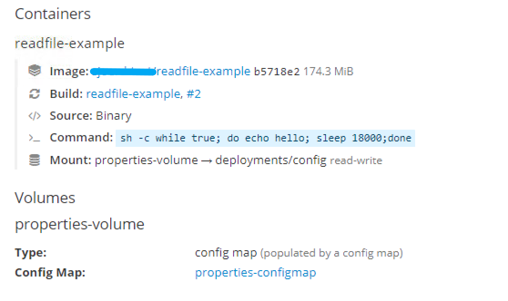

# Deploying a properties file next to your jar on OpenShift

I've recently had the situation where I deployed a Spring Boot application on OpenShift where a certain dependency needed a properties file that couldn't be found. The
 problem was that this dependency didn't scan the classpath for the file, but just opened a FileInputStream relative to the current path.
 
 In this blogpost I will guide you through the process of deploying a text file next to a jar in an OpenShift container. I've reproduced an
  example scenario, but you can skip these steps and go right to the solution if you want to.
  
  ## The Example Scenario
  To reproduce the problem just described we need a jar with some Java code reading a file located next to the jar. 
  
  #### The code:
  
  ```
public class ReadFileExample {

    public static void main(String[] args) throws IOException {
        String propsLocation = System.getenv("PROPS_LOCATION");
        try (FileInputStream fis = new FileInputStream(propsLocation)) {
            int i = 0;
            do {
                byte[] buf = new byte[1024];
                i = fis.read(buf);

                String value = new String(buf, StandardCharsets.UTF_8);
                System.out.print(value);

            } while (i != -1);
        }
    }
}
```

The code just opens a FileInputStream for which the location is taken from the environment property PROPS_LOCATION. 
The contents of the file are then printed to the OutputStream.

#### The input file
I've created a properties.example file containing: `welcome bob`

If you want to run the code locally you'll need to set the PROPS_LOCATION env var:

`export PROPS_LOCATION=../resources/properties.example`

#### Creating a jar
First off, we need to compile the code:

`javac ReadFileExample.java -d ../output/`

then add a MANIFEST.MF with the main class to run, in the same output dir:

```
Manifest-Version: 1.0
Main-Class: ReadFileExample
```

and then to create the jar:

`jar cfm readfileexample.jar MANIFEST.MF *.class`

Place the jar in a specific dir, we'll need it when creating the image on OpenShift.

### Creating and deploying an image from the jar
To create and deploy an image we need to specify the objects we need to OpenShift.
We need a BuildConfig, ImageStream and a DeploymentConfig.

I've specified the needed objects in yaml format in an OpenShift template:

```
apiVersion: template.openshift.io/v1
kind: Template
metadata:
  name: readfileexample-template
  annotations:
    openshift.io/display-name: readfileexample-template
labels:
  template: readfileexample-template

objects:
  - apiVersion: image.openshift.io/v1
    kind: ImageStream
    metadata:
      name: readfile-example
      labels:
        app: readfile-example

  - kind: BuildConfig
    apiVersion: v1
    metadata:
      name: readfile-example
    spec:
      strategy:
        sourceStrategy:
          from:
            kind: ImageStreamTag
            name: java:8
            namespace: openshift
        type: Source
      source:
        type: Binary
        binary:
          asFile: readfileexample.jar
      output:
        to:
          kind: ImageStreamTag
          name: readfile-example:latest

  - apiVersion: apps.openshift.io/v1
    kind: DeploymentConfig
    metadata:
      name: readfile-example
    spec:
      replicas: 1
      selector:
        app: readfile-example
      strategy:
        type: Rolling
      test: false
      template:
        metadata:
          labels:
            app: readfile-example
        spec:
          containers:
             // to prevent the container from going idle, we'll run this infinite loop
            - command:
                - "sh"
              args:
                - "-c"
                - "while true; do echo hello; sleep 18000;done"
              image: " "
              imagePullPolicy: IfNotPresent
              name: readfile-example
      triggers:
        - imageChangeParams:
            automatic: true
            containerNames:
              - readfile-example
            from:
              kind: ImageStreamTag
              name: readfile-example:latest
          type: ImageChange
        - type: ConfigChange

```

In the container spec I've added a shell command to execute to keep the container alive.
It's a simple infinite loop so that the container doesn't become idle and won't get killed by openshift.

### Starting the Build
To upload the locally created jar and start the just configured build run this command:

`oc start-build readfile-example --from-dir=./jardir/`

### Creating and mounting the input file on OpenShift
To create and mount an input file we need to add a ConfigMap to our template:

```
  - apiVersion: v1
    kind: ConfigMap
    metadata:
      name: properties-configmap
    data:
      properties.example: welcome bob
```

And change our DeploymentConfig to add a volume with our ConfigMap, and mount this volume to a specific path

```
     template:
        metadata:
          labels:
            app: readfile-example
        spec:
          volumes:
            - name: properties-volume
              configMap:
                name: properties-configmap
          containers:
            - volumeMounts:
                - mountPath: "deployments/config"
                  name: properties-volume
```

All we need now is to add an environment variable to our deployment, pointing to the mounted file from our ConfigMap

```
              env:
                - name: PROPS_LOCATION
                  value: "config/properties.example"
```

### Verifying the deployment
If all went well your deployment should look like this


### Running the jar
In the OpenShift console go to your deployment and click on the created pod and enter the terminal,
here you'll find the jar and mounted input file in the `/deployments` dir.

Here is the output result:
```
sh-4.2$ java -jar readfileexample.jar 
welcome bob
```

Good luck and have fun with your properties files on OpenShift!
